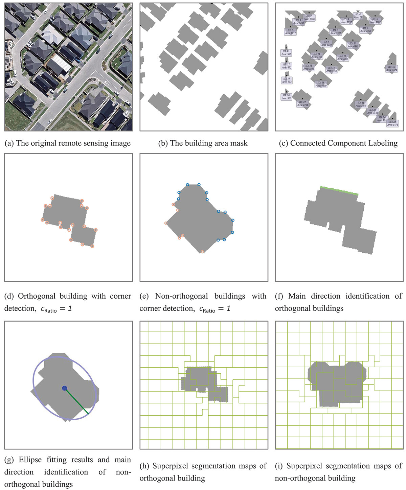

# A Raster-Based Method for Building Simplification and Texturing

Code and output data for the paper "A raster-based method for building simplification considering shape and texture features based on remote sensing images."

Ruijie Fan and Yilang Shen, *Geo-spatial Information Science* (2025). [Paper](https://doi.org/10.1080/10095020.2025.2573369)



## Method

The method works directly with raster building masks. It separates connected buildings, classifies each footprint as orthogonal or non-orthogonal from its corner distribution, estimates the main direction, and applies SEEDS superpixel segmentation. Superpixels are retained according to the proportion of building pixels they contain. The simplified footprint is then rotated back to its original orientation and placed in the source image.

The paper also describes texture selection and color adjustment for rendering the simplified buildings in remote sensing imagery.

## Repository contents

- `main.py`: batch-processing entry point.
- `Preprocessor.py`: connected-component extraction and per-building mask preparation.
- `Simplifier.py`: orientation estimation, SEEDS segmentation, and footprint simplification.
- `Reset.py`: restores simplified footprints to their original position and records comparison metrics.
- `texturePainted.py`: texture application used during reconstruction.
- `Outputs/`: precomputed TIFF outputs.

## Environment

The scripts use Python with NumPy, OpenCV (including `opencv-contrib-python` for `ximgproc`), pandas, and Rich.

This repository is a research snapshot rather than a packaged command-line application. Before running `main.py`, update the input, output, base-image, and texture-library paths for your local data. The current entry point also references experiment modules and assets from the original project environment that are not included here.

## Citation

```bibtex
@article{fan2025raster,
  title   = {A Raster-Based Method for Building Simplification Considering Shape and Texture Features Based on Remote Sensing Images},
  author  = {Fan, Ruijie and Shen, Yilang},
  journal = {Geo-spatial Information Science},
  year    = {2025},
  pages   = {1--21},
  doi     = {10.1080/10095020.2025.2573369}
}
```
